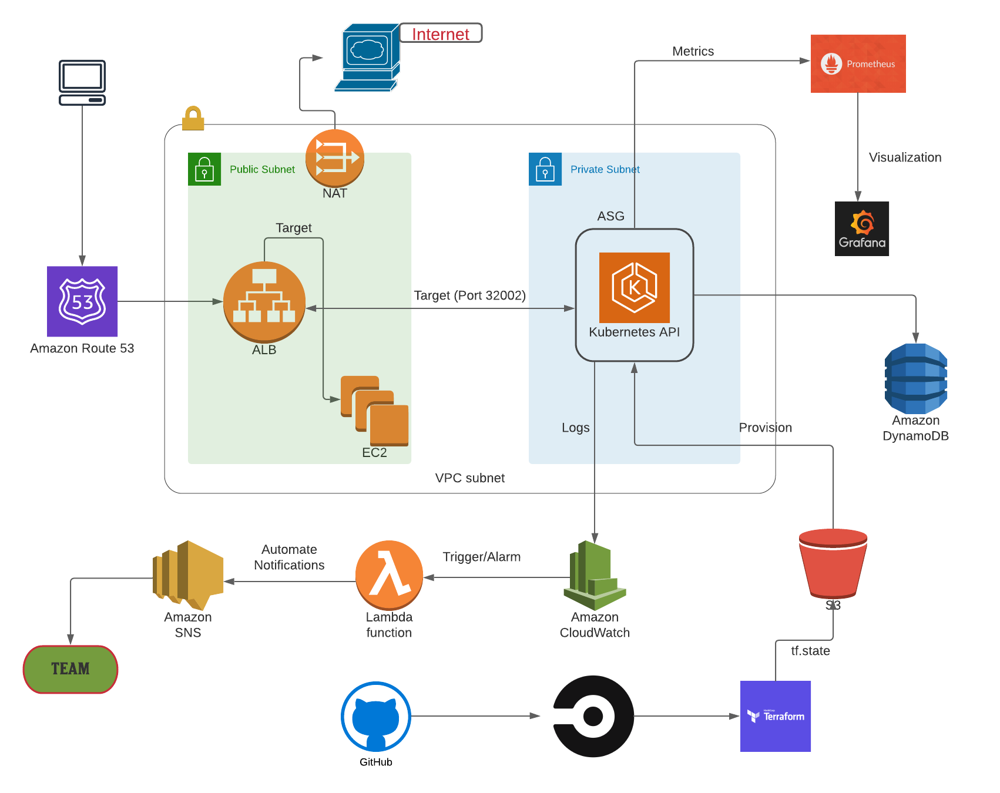

# Infrastructure   
  **Extended from [core-infrastructure](https://github.com/TheOnly-Co/core-infrastructure)** 

  **Security infrastructure built to support Pongplanet LLC.** 

## CI/CD (CircleCi)

 - Configure `config.yml` to allow asynchronous updates with github
 - Staging to plan/apply and delivery workflows to production 

## Cloud Services (AWS)
 - Virtual Private Cloud
   - Setup VPC routing between accounts and vendors with Transit gateways
   - Provision components with terraform
   - Scale across the infrastructure to allow high availability
 - Elastic Kubernetes Service (EKS)
   - Setup RBAC to allow specific user to access  
   - [Authenticate with Okta and kube2iam assume-role](https://github.com/TheOnly-Co/oktaasume)
   - Couple CICD with helm to deploy microservices 
   - Logging and monitoring with elaticsearch
   - Deploy containerized services and work with Docker images     
 - Load Balancing
   - Application load balancing to imporve avaliability
   - Create Ingress rules for resource routings
## Security (Okta&IAM)

 - Implement AWS roles and permissions with Okta SAML authentication
 - Enforce MFA Okta push notification on users
 - Tie Okta users login to IAM role based access

## Infrastructure Design

## Lincense

Copyright (c) 2021 TheOnly-Co
